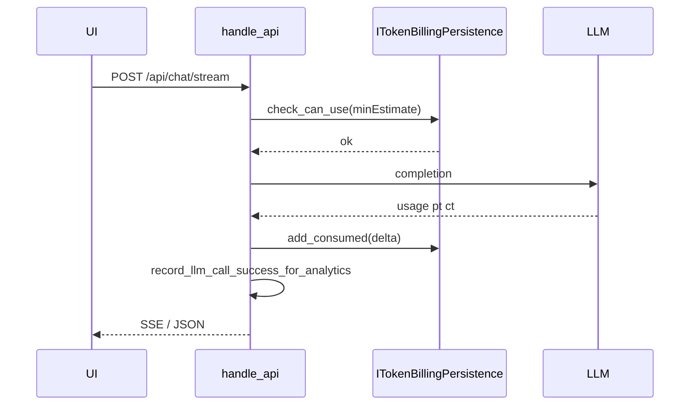

# 订阅与 Token 计费模块说明

本文档对应 `需求.txt` 中的「模块划分、接口定义」：说明持久化边界、C++ 抽象接口、HTTP API，以及对话 / 代码检测的扣费时序。

## 1. 概念与数据

| 字段 | 说明 |
|------|------|
| `subscription_tier` | `free` / `go` / `plus` / `pro` |
| `token_quota` | 当前自然月内的总额度（由套餐决定） |
| `tokens_consumed` | 当前自然月内已消耗 Token 累计 |
| `period_yyyymm` | 计费月份，如 `202604` |

剩余额度 = `token_quota - tokens_consumed`（由接口计算，不单列存储）。

默认各档月度 `token_quota` 定义于 [`src/storage/token_billing_common.hpp`](../src/storage/token_billing_common.hpp) 中的 `billing_token_quota_for_tier`。

## 2. C++ 接口 `ITokenBillingPersistence`

声明位置：[`src/storage/storage_iface.hpp`](../src/storage/storage_iface.hpp)。

| 方法 | 作用 |
|------|------|
| `get_state(user_id, out, error)` | 懒初始化；若月份变更则清空当月 `tokens_consumed` 并按档位刷新 `token_quota`。 |
| `check_can_use(user_id, min_tokens_needed, state_out, error)` | 若剩余额度不足 `min_tokens_needed` 则失败。 |
| `add_consumed(user_id, delta, state_out, error)` | 成功调用 LLM 后按估算或实际 usage 增加消耗。 |
| `apply_subscription(user_id, tier, pay_method, out_txn_id, error)` | 模拟开通（仅 `go`/`plus`/`pro`，`pay_method` 为 `wechat` 或 `alipay`），重置当月消耗并更新档位与配额。 |

### 实现与 DLL

- **文件后端**：[`src/storage/file_token_billing.cpp`](../src/storage/file_token_billing.cpp)，路径 `data_dir/users/<id>/billing.json`。
- **SQL 后端**：[`src/storage/sql_bundle.cpp`](../src/storage/sql_bundle.cpp) 内 `SqlTokenBillingPersistence`，表 `dbo.UserBilling`（全量脚本 [`scripts/sql/schema.sql`](../scripts/sql/schema.sql)，增量 [`scripts/sql/schema_incremental_userbilling.sql`](../scripts/sql/schema_incremental_userbilling.sql)）。
- **导出**：`cct_sql_bundle_token_billing`（[`sql_bundle_exports.hpp`](../src/storage/sql_bundle_exports.hpp)），与 `cct-storage.dll` 一并发布。

## 3. HTTP API

| 方法与路径 | 认证 | 说明 |
|------------|------|------|
| ` GET /api/me` | 需要 Cookie | 增加 `subscriptionTier`、`subscriptionLabel`、`tokenQuota`、`tokensConsumed`、`tokensRemaining`、`periodYm`。 |
| ` GET /api/billing/plans` | 否 | 返回静态构造的套餐列表（含 `priceCny`、`tokenQuota`、`features`）。 |
| ` POST /api/billing/subscribe` | 需要 | JSON：`tier`（`go`/`plus`/`pro`）、`payMethod`（`wechat`/`alipay`）。成功返回 `transactionId`（`mock-*` 前缀）及更新后的额度字段。 |

错误：

- Token 不足：`429`，body 中含 `"code":"token_exhausted"` 与 `error` 文案。
- 免费用户仍受 `llm_daily_call_limit` 约束时：`429`，`"code":"daily_limit_exceeded"`。

路由实现：[`src/web/server.cpp`](../src/web/server.cpp) 中 `handle_api`。

## 4. 与 LLM 调用的协作顺序

- **代码检测** `POST /api/code-scan/run`：在拼好审计 prompt 后、`check_can_use`，成功响应前 `add_consumed`（最小消耗下限高于普通对话）。
- **非流式** `POST /api/chat`：逻辑与流式一致，失败时回滚本轮 user 消息。

## 5. 前端

- 侧栏用户区与套餐/收银台 UI：[`ui/app.html`](../ui/app.html)、[`ui/css/style.css`](../ui/css/style.css)。
- 交互脚本：[`ui/js/billing/billing-modals.js`](../ui/js/billing/billing-modals.js)；与 [`ui/js/app.js`](../ui/js/app.js) 的 `/api/me` 字段同步。
- 额度耗尽时：[`ui/js/chat.js`](../ui/js/chat.js)、[`ui/js/code-scan.js`](../ui/js/code-scan.js) 在 `429` 且 `code` 为 `token_exhausted` / `daily_limit_exceeded` 时调用 `cctOpenBillingPlans()`。

## 6. 支付说明（演示）

当前不接入真实微信/支付宝 SDK；`apply_subscription` 仅写入本地/SQL 状态并生成 `mock-*` 流水号，便于后续替换为真实回调与签名校验。
